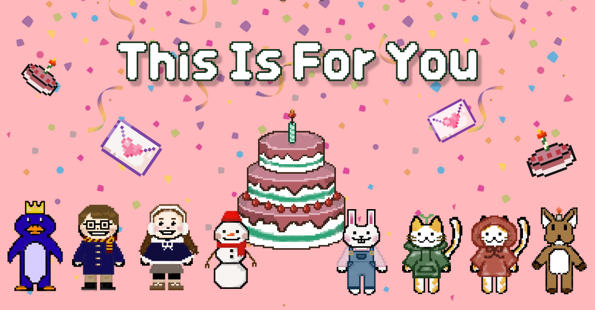

# This is For You 🍰

`한국외국어대학교 멋쟁이사자처럼 11기 🦁` - 3팀 `2TF`의 miniproject 입니다 :)



## Team members:
귀염 뽀짝한 3팀 멤버들을 소개합니다 ⸜(♡'ᗜ'♡)⸝

<!-- ALL-CONTRIBUTORS-LIST:START - Do not remove or modify this section -->
<!-- prettier-ignore-start -->
<!-- markdownlint-disable -->

<table>
  <tr>
    <td align="center">
    <a href="https://github.com/CosmicSandBox">
    
    <br />
    <sub>
    <b>JaeWoo Kim</b><br>
    <b>🌟 Mentor / Front-End</b>
    </sub>
    </a>
    <br />
    </td>
    <td align="center">
    <a href="https://github.com/KimJJRoSY">
    
    <br />
    <sub>
    <b>JeongJoo Kim</b><br>
    <b>💟 Front-end</b>
    </sub>
    </a>
    <br />
    </td>    <td align="center">
    <a href="https://github.com/moonxxpower">
    
    <br />
    <sub>
    <b>SuHyun Moon</b><br>
    <b>🍬 Back-End</b>
    </sub>
    </a>
    <br />
    </td>    
    <td align="center">
    <a href="https://github.com/InKyungWoo">
    
    <br />
    <sub>
    <b>Inkyung Woo</b><br>
    <b>🎨 Design / Front-End</b>
    </sub>
    </a>
    <br />
    </td>
  </tr>
</table>

<!-- markdownlint-restore -->
<!-- prettier-ignore-end -->

<!-- ALL-CONTRIBUTORS-LIST:END -->

<br>

## Required

> ❗️clone 받은 후 node modules 폴더 (있으면) 삭제, package-lock.jsom 삭제 후에 ❗️ <br> `npm install` & 아래 라이브러리들 차례대로 설치하고 빌드해주시면 됩니다

- Router (꼭 v6로 설치할 것❗️)

```
npm install react-router-dom@6
```

- Popup창 기능

```
npm install react-modal
```

- 폭죽 효과

```
npm i canvas-confetti
```
```
npm install --save canvas-confetti
```